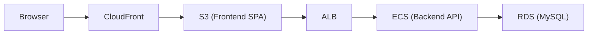
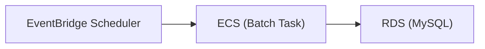

# Housework Hub (HwHub)

## 概要

Housework
Hub（HwHub）は、家庭内の家事・買い物・メンバー管理を協調的に行うためのアプリケーションです。  
複数のおうち（Household）をサポートし、家事タスクのテンプレート化、定期実行、担当者割当、履歴管理などを提供します。

本リポジトリ群は以下の構成で成り立っています：

- **hw-hub-backend** : メインAPI（Spring Boot / MyBatis / MySQL）
- **hw-hub-batch** : 定期バッチ処理（Spring Batch / ECS Fargate）
- **hw-hub-frontend** : フロントエンド（Vue 3 + Vite + TypeScript）
- **hw-hub-database** : DBスキーマ・Flywayマイグレーション管理

---

## 全体アーキテクチャ

- Backend / Batch は AWS ECS Fargate 上で稼働
- DB は Amazon RDS (MySQL)
- ファイル保存は S3
- 認証は JWT
- フロントエンドは S3 + CloudFront によりホスティング
- バッチは EventBridge Scheduler により起動

### High-level Flow

Online(frontend + backend)

Batch Processing

---

## リポジトリ一覧と役割

| リポジトリ                                                       | 役割                                                   |
| ---------------------------------------------------------------- | ------------------------------------------------------ |
| [hw-hub-backend](https://github.com/ryokkon624/hw-hub-backend)   | REST API / 認証 / 業務ロジック                         |
| [hw-hub-batch](https://github.com/ryokkon624/hw-hub-batch)       | 定期実行ジョブ（タスク生成、再計算、期限切れ処理など） |
| [hw-hub-frontend](https://github.com/ryokkon624/hw-hub-frontend) | Web UI                                                 |
| [hw-hub-database](https://github.com/ryokkon624/hw-hub-database) | Flyway によるスキーマ管理                              |

---

## 開発方針・ポリシー

### Backend

- Java 21 / Spring Boot 3.x
- MyBatis + MyBatis Generator
- Flyway によるマイグレーション管理
- DDD 風レイヤード構成
- WHO カラム（create_user_id / created_at / update_user_id / updated_at / etc）を全テーブルに保持
- コードマスタ（m_code）から Enum を自動生成

### Frontend

- Vue 3 + Composition API + TypeScript
- Pinia（すべての API コールは Store Action からaxiosを薄くラップしたclientを呼び出す）
- Tailwind CSS
- vue-i18n による多言語対応

### テスト

- Backend / Batch: Spock + JUnit Platform + JaCoCo
- Frontend: Vitest
- GitHub Actions により Coverage レポートを GitHub Pages に公開

---

## CI / CD 概要

- push to main で以下を自動実行
  - テスト
  - カバレッジ生成
  - Docker build & push (ECR)
  - ECS TaskDefinition 更新
  - Scheduler / Service への反映
- カバレッジレポートは GitHub Pages に公開

---

## カバレッジレポート

- Backend: GitHub Pages (backend coverage workflow)
- Batch: GitHub Pages (batch coverage workflow)
- Frontend: GitHub Pages (frontend coverage workflow)

---

## ドキュメント構成

- 本 README: プロジェクト全体概要
- 各リポジトリ配下の README: xxxx_README.md
  - セットアップ方法
  - 開発手順
  - テスト実行方法
  - デプロイ方法
  - 運用時の注意点

---

## 次に読むべきドキュメント

- [backend_README.md](https://github.com/ryokkon624/hw-hub-backend/blob/main/backend_README.md)
- [batch_README.md](https://github.com/ryokkon624/hw-hub-batch/blob/main/batch_README.md)
- [frontend_README.md](https://github.com/ryokkon624/hw-hub-frontend/blob/main/frontend_README.md)
- [database_README.md](https://github.com/ryokkon624/hw-hub-database/blob/main/database_README.md)

---

## ステータス

このプロジェクトは以下の状態に到達しています：

- アーキテクチャ確定
- CI/CD パイプライン構築済み
- 高カバレッジなテスト整備済み
- 本番運用を想定した構成・監視・デプロイフロー整備済み
