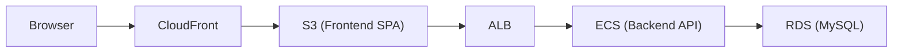
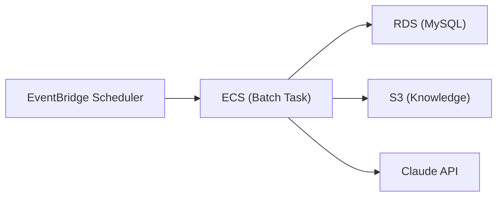
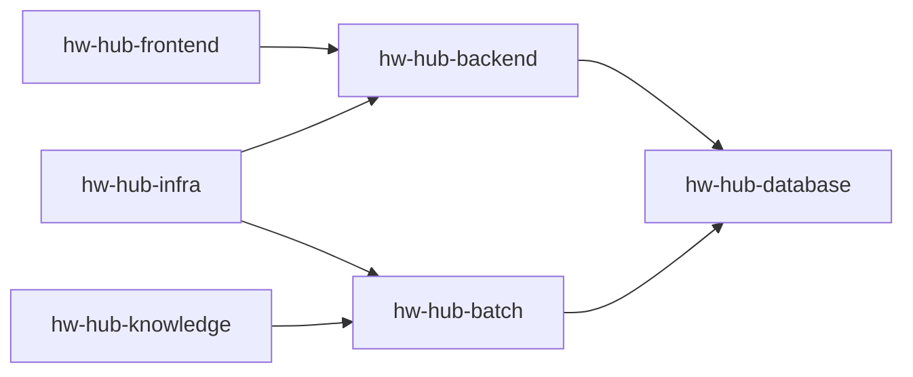
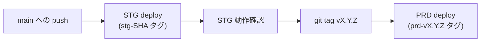
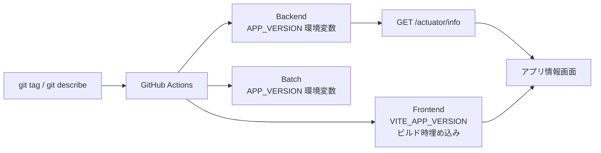

# Housework Hub (HwHub)

---

## Overview

Housework Hub（HwHub）は、家庭内の家事・買い物・メンバー管理を協調的に行うためのアプリケーションです。  
複数のおうち（Household）をサポートし、家事タスクのテンプレート化、定期実行、担当者割当、履歴管理などを提供します。

本リポジトリ群は以下の構成で成り立っています。

- **hw-hub-backend** : メインAPI（Spring Boot / MyBatis / MySQL）
- **hw-hub-batch** : 定期バッチ処理（Spring Batch / ECS Fargate）
- **hw-hub-frontend** : フロントエンド（Vue 3 + Vite + TypeScript）
- **hw-hub-database** : DBスキーマ・Flywayマイグレーション管理
- **hw-hub-infra** : AWSインフラ（Terraform）
- **hw-hub-knowledge** : AIサポートナレッジ（S3同期）

---

## Architecture

- Backend / Batch は AWS ECS Fargate 上で稼働
- DB は Amazon RDS (MySQL)
- ファイル保存は S3
- 認証は JWT
- フロントエンドは S3 + CloudFront によりホスティング
- バッチは EventBridge Scheduler により起動
- インフラは Terraform により管理

### High-level Flow

Online (Frontend + Backend)

Batch Processing

---

## Tech stack

### Backend
- Java 21
- Spring Boot 4.x
- MyBatis + MyBatis Generator
- Flyway
- MySQL

### Frontend
- Vue 3 + Composition API
- TypeScript
- Pinia
- Tailwind CSS
- vue-i18n

### Infrastructure
- AWS ECS Fargate
- Application Load Balancer
- Amazon RDS (MySQL)
- Amazon S3
- CloudFront
- EventBridge Scheduler
- CloudWatch / SNS
- **Terraform**

---
## Repository Structure

| Repository | Role |
|------------------------------------------------------------------|-----------------------------|
| [hw-hub-backend](https://github.com/ryokkon624/hw-hub-backend)   | REST API / authentication / business logic |
| [hw-hub-batch](https://github.com/ryokkon624/hw-hub-batch)       | scheduled batch processing |
| [hw-hub-frontend](https://github.com/ryokkon624/hw-hub-frontend) | Web UI |
| [hw-hub-database](https://github.com/ryokkon624/hw-hub-database) | Flyway database schema |
| [hw-hub-infra](https://github.com/ryokkon624/hw-hub-infra) | Terraform infrastructure |
| [hw-hub-knowledge](https://github.com/ryokkon624/hw-hub-knowledge) | AI support knowledge base (S3 sync) |

---

## Repository Relationship

---

## CI / CD 概要

GitHub Actions により CI/CD を構築しています。

main への push で以下を実行：

- テスト
- カバレッジ生成
- Docker build & push (ECR)
- ECS TaskDefinition 更新
- ECS Service / Scheduler 反映

---

## Coverage Report
- Backend: [GitHub Pages](https://ryokkon624.github.io/hw-hub-backend/)
- Batch: [GitHub Pages](https://ryokkon624.github.io/hw-hub-batch/)
- Frontend: [GitHub Pages](https://ryokkon624.github.io/hw-hub-frontend/)

---

## Infrastructure as Code

**Terraform**を使用しています。

Managed resources include:

- ECS services
- ECS batch tasks
- networking configuration
- monitoring and alerts
- scheduled jobs

Some existing AWS resources are referenced rather than managed:

- ALB
- RDS
- CloudFront
- S3
- SNS

---

## Development

各リポジトリにそれぞれの詳細を記載したREADMEファイルがあります。

- [backend_README.md](https://github.com/ryokkon624/hw-hub-backend/blob/main/backend_README.md)
- [batch_README.md](https://github.com/ryokkon624/hw-hub-batch/blob/main/batch_README.md)
- [frontend_README.md](https://github.com/ryokkon624/hw-hub-frontend/blob/main/frontend_README.md)
- [database_README.md](https://github.com/ryokkon624/hw-hub-database/blob/main/database_README.md)
- [infra_README.md](https://github.com/ryokkon624/hw-hub-infra/blob/main/infra_README.md)

---

## Versioning Strategy

HwHub は [Semantic Versioning](https://semver.org/) に基づいてバージョンを管理しています。

### バージョン形式

| 種別 | 形式 | 例 | 説明 |
|------|------|----|------|
| PRD リリース | `vMAJOR.MINOR.PATCH` | `v1.2.0` | git tag がそのままバージョンになる |
| STG ビルド | `vMAJOR.MINOR.PATCH-stg.N` | `v1.2.0-stg.3` | 直前のタグから N コミット後のビルド |
| ローカル開発 | `local` | `local` | 環境変数未設定時のデフォルト値 |

### バージョンアップルール

| 変更種別 | 上げるバージョン | 例 |
|----------|------------------|----|
| 破壊的変更（API非互換・DB大規模変更） | MAJOR | `v1.0.0` → `v2.0.0` |
| 機能追加（feature リリース） | MINOR | `v1.0.0` → `v1.1.0` |
| バグ修正のみ | PATCH | `v1.0.0` → `v1.0.1` |

### リリースフロー

### リポジトリ別バージョン管理

各リポジトリのタグは独立して管理されます。  
PATCH リリースではフロントエンドのみ・バックエンドのみのデプロイが発生するため、  
アプリ情報画面ではフロントとAPIのバージョンを個別に表示しています。

| リポジトリ | タグ管理 | CI/CDトリガー |
|------------|----------|---------------|
| hw-hub-frontend | 独立タグ | main push → STG / git tag → PRD |
| hw-hub-backend | 独立タグ | main push → STG / git tag → PRD |
| hw-hub-batch | 独立タグ | main push → STG / git tag → PRD |

### バージョン情報の伝搬

### ECR イメージタグ規則

| 環境 | タグ形式 | 例 |
|------|----------|----|
| STG（コミット単位） | `stg-${GITHUB_SHA}` | `stg-abc1234` |
| STG（最新） | `stg-latest` | `stg-latest` |
| PRD（バージョン単位） | `prd-vX.Y.Z` | `prd-v1.2.0` |
| PRD（最新） | `prd-latest` | `prd-latest` |

---

## Future Roadmap

Planned improvements:

- mobile application (Capacitor)
- analytics dashboard
- expanded multi-language support

---

## Project Status

- architecture established
- CI/CD pipeline implemented
- high test coverage achieved
- infrastructure managed via Terraform
