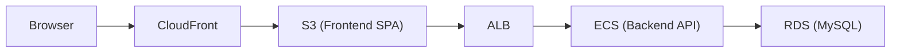
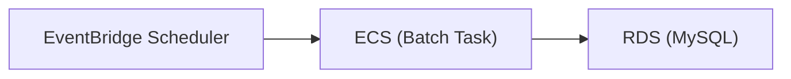
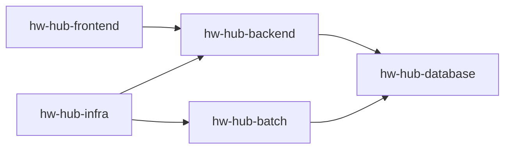

# Housework Hub (HwHub)

---

## Overview

Housework Hub（HwHub）は、家庭内の家事・買い物・メンバー管理を協調的に行うためのアプリケーションです。  
複数のおうち（Household）をサポートし、家事タスクのテンプレート化、定期実行、担当者割当、履歴管理などを提供します。

本リポジトリ群は以下の構成で成り立っています。

- **hw-hub-backend** : メインAPI（Spring Boot / MyBatis / MySQL）
- **hw-hub-batch** : 定期バッチ処理（Spring Batch / ECS Fargate）
- **hw-hub-frontend** : フロントエンド（Vue 3 + Vite + TypeScript）
- **hw-hub-database** : DBスキーマ・Flywayマイグレーション管理
- **hw-hub-infra** : AWSインフラ（Terraform）

---

## Architecture

- Backend / Batch は AWS ECS Fargate 上で稼働
- DB は Amazon RDS (MySQL)
- ファイル保存は S3
- 認証は JWT
- フロントエンドは S3 + CloudFront によりホスティング
- バッチは EventBridge Scheduler により起動
- インフラは Terraform により管理

### High-level Flow

Online (Frontend + Backend)

Batch Processing

---

## Tech stack

### Backend
- Java 21
- Spring Boot 3.x
- MyBatis + MyBatis Generator
- Flyway
- MySQL

### Frontend
- Vue 3 + Composition API
- TypeScript
- Pinia
- Tailwind CSS
- vue-i18n

### Infrastructure
- AWS ECS Fargate
- Application Load Balancer
- Amazon RDS (MySQL)
- Amazon S3
- CloudFront
- EventBridge Scheduler
- CloudWatch / SNS
- **Terraform**

---
## Repository Structure

| Repository | Role |
|------------------------------------------------------------------|-----------------------------|
| [hw-hub-backend](https://github.com/ryokkon624/hw-hub-backend)   | REST API / authentication / business logic |
| [hw-hub-batch](https://github.com/ryokkon624/hw-hub-batch)       | scheduled batch processing |
| [hw-hub-frontend](https://github.com/ryokkon624/hw-hub-frontend) | Web UI |
| [hw-hub-database](https://github.com/ryokkon624/hw-hub-database) | Flyway database schema |
| [hw-hub-infra](https://github.com/ryokkon624/hw-hub-infra) | Terraform infrastructure |

---

## Repository Relationship

---

## CI / CD 概要

GitHub Actions により CI/CD を構築しています。

main への push で以下を実行：

- テスト
- カバレッジ生成
- Docker build & push (ECR)
- ECS TaskDefinition 更新
- ECS Service / Scheduler 反映

---

## Coverage Report
- Backend: [GitHub Pages](https://ryokkon624.github.io/hw-hub-backend/)
- Batch: [GitHub Pages](https://ryokkon624.github.io/hw-hub-batch/)
- Frontend: [GitHub Pages](https://ryokkon624.github.io/hw-hub-frontend/)

---

## Infrastructure as Code

**Terraform**を使用しています。

Managed resources include:

- ECS services
- ECS batch tasks
- networking configuration
- monitoring and alerts
- scheduled jobs

Some existing AWS resources are referenced rather than managed:

- ALB
- RDS
- CloudFront
- S3
- SNS

---

## Development

各リポジトリにそれぞれの詳細を記載したREADMEファイルがあります。

- [backend_README.md](https://github.com/ryokkon624/hw-hub-backend/blob/main/backend_README.md)
- [batch_README.md](https://github.com/ryokkon624/hw-hub-batch/blob/main/batch_README.md)
- [frontend_README.md](https://github.com/ryokkon624/hw-hub-frontend/blob/main/frontend_README.md)
- [database_README.md](https://github.com/ryokkon624/hw-hub-database/blob/main/database_README.md)
- [infra_README.md](https://github.com/ryokkon624/hw-hub-infra/blob/main/infra_README.md)

---

## Future Roadmap

Planned improvements:

- mobile application (Capacitor)
- push notifications
- analytics dashboard
- expanded multi-language support

---

## Project Status

- architecture established
- CI/CD pipeline implemented
- high test coverage achieved
- infrastructure managed via Terraform
