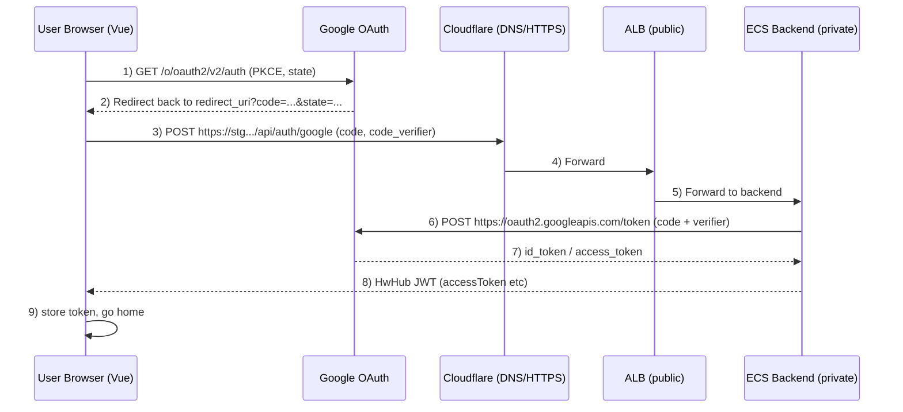
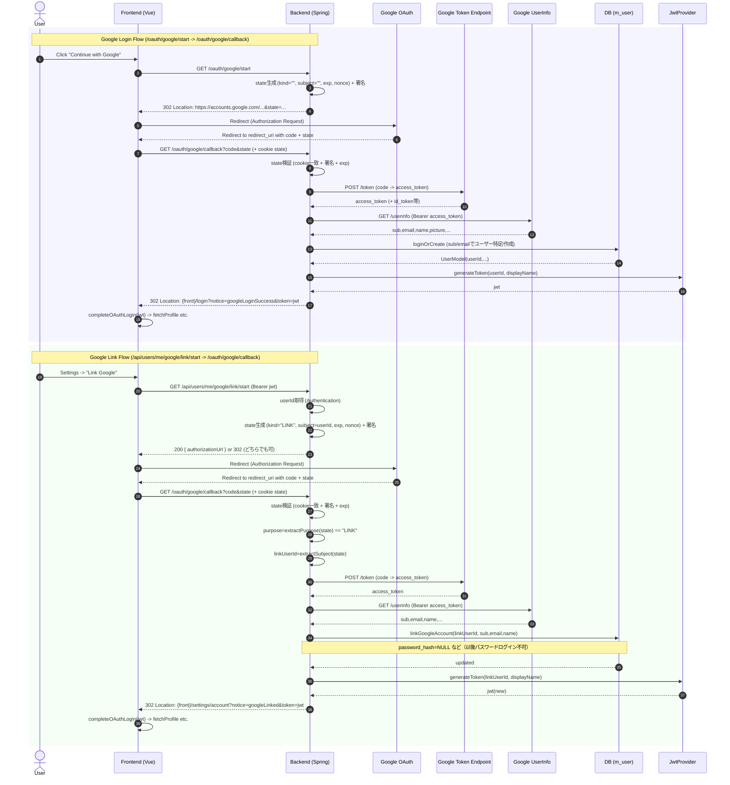

# Google OAuth

## 1. 概要
HwHubではメールアドレス/パスワードを使ったログインとGoogleアカウントを使ったログインをサポートする。当文章はGoogleアカウントを使ったログインとGoogleアカウントの連携について記載する。

## 2. シーケンス図

## 3. API仕様

### 3.1. Google OAuth: ログイン
OAuthでHwHubにログインする際に利用するAPI群。

| メソッド | パス | 説明 |
| --- | --- | --- |
| GET | /oauth/google/start | Google OAuth開始。stateを生成し、Cookieに保存後、Googleの認証画面にリダイレクトする。 |
| GET | /oauth/google/callback | Google OAuthコールバック。stateを検証後、Googleからアクセストークンを取得し、HwHubのJWTを生成して返す。 |

### 3.2. Google Link: アカウントの連携
ログイン中のHwHubアカウントにGoogleアカウントを連携する際に利用するAPI群。

| メソッド | パス | 説明 |
| --- | --- | --- |
| GET | /api/users/me/google/link/start | Google Link開始。stateを生成し、Cookieに保存後、Googleの認証画面にリダイレクトする。 |
| GET | /api/users/me/google/link/callback | Google Linkコールバック。stateを検証後、Googleからアクセストークンを取得し、HwHubのJWTを生成して返す。 |
