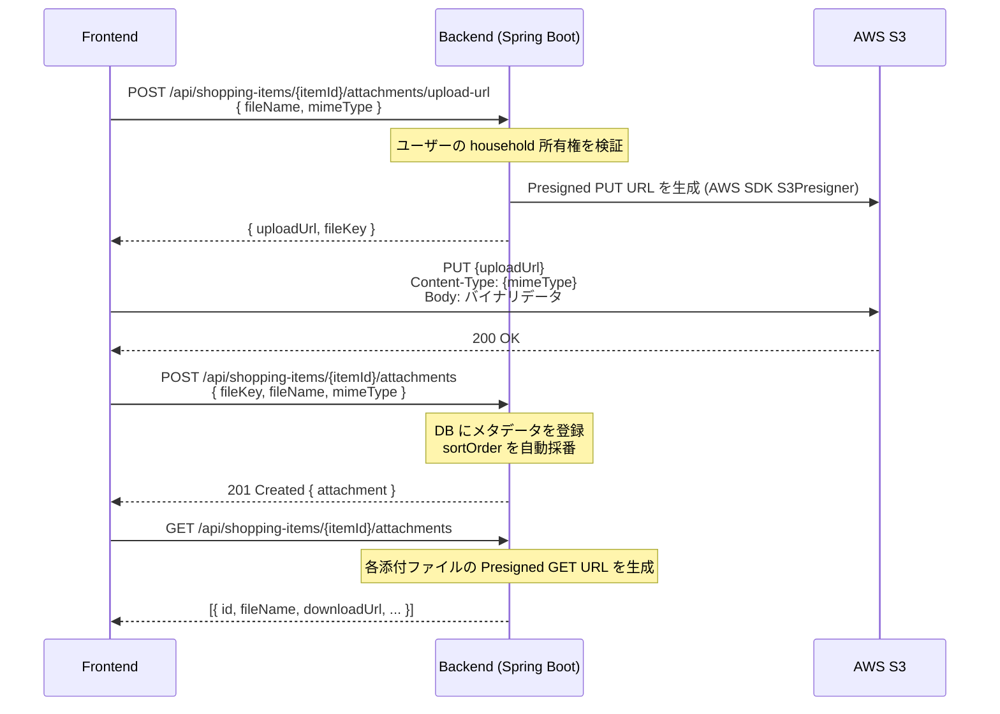
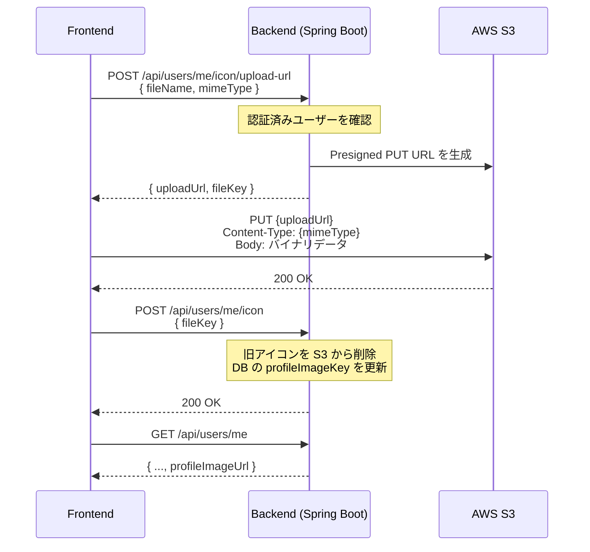

# 画像アップロード実装方式

## 概要

画像アップロードは **S3 Presigned URL による直接アップロード方式** を採用している。
バックエンドはファイルデータを中継せず、一時的な署名付きURLを発行するのみ。
フロントエンドはそのURLを使って S3 へ直接 PUT する。

```
フロントエンド → バックエンド (Presigned URL 発行)
フロントエンド → S3          (ファイルを直接 PUT)
フロントエンド → バックエンド (メタデータ登録)
```

---

## 対象機能

| 機能               | アップロード先 S3 キー形式                                  |
|--------------------|-------------------------------------------------------------|
| 買い物アイテム添付 | `shopping-item/{householdId}/{itemId}/{uuid}.{ext}`         |
| ユーザーアイコン   | `user-icon/{userId}/icon.{ext}`                             |

---

## シーケンス図

### 買い物アイテム添付ファイル



### ユーザーアイコン



---

## エンドポイント一覧

### 買い物アイテム添付ファイル

#### `POST /api/shopping-items/{itemId}/attachments/upload-url`

Presigned PUT URL を発行する。

**リクエスト**
```json
{
  "fileName": "photo.jpg",
  "mimeType": "image/jpeg"
}
```

**レスポンス**
```json
{
  "uploadUrl": "https://s3.amazonaws.com/bucket/shopping-item/1/42/uuid.jpg?X-Amz-Signature=...",
  "fileKey": "shopping-item/1/42/uuid.jpg"
}
```

---

#### `POST /api/shopping-items/{itemId}/attachments`

S3 へのアップロード完了後にメタデータを登録する。

**リクエスト**
```json
{
  "fileKey": "shopping-item/1/42/uuid.jpg",
  "fileName": "photo.jpg",
  "mimeType": "image/jpeg"
}
```

**レスポンス**: 登録された添付ファイルオブジェクト

---

#### `GET /api/shopping-items/{itemId}/attachments`

添付ファイル一覧を取得する。レスポンスには Presigned GET URL が含まれる。

---

### ユーザーアイコン

#### `POST /api/users/me/icon/upload-url`

アイコン用 Presigned PUT URL を発行する。

**リクエスト**
```json
{
  "fileName": "avatar.png",
  "mimeType": "image/png"
}
```

**レスポンス**
```json
{
  "uploadUrl": "https://s3.amazonaws.com/bucket/user-icon/5/icon.png?X-Amz-Signature=...",
  "fileKey": "user-icon/5/icon.png"
}
```

---

#### `POST /api/users/me/icon`

アップロード完了後に DB を更新する。既存アイコンは S3 からも削除される。

**リクエスト**
```json
{
  "fileKey": "user-icon/5/icon.png"
}
```

---

## フロントエンド実装

### S3 への直接アップロード

`src/api/authApi.ts` に共通関数 `putToPresignedUrl` を定義している。

```typescript
// fetch() を使い PUT でバイナリを送信
// S3 は CORS エラー時にレスポンスボディを返さないため、
// ステータスコードのみで判定する
await putToPresignedUrl(uploadUrl, file);
```

### Store での処理フロー

`src/stores/shoppingItemAttachmentStore.ts` の `uploadAttachment` が 3 ステップを順に実行する。

1. `createUploadUrl()` → Presigned URL 取得
2. `putToPresignedUrl()` → S3 直接アップロード
3. `createAttachment()` → メタデータ登録
4. `fetchAttachments()` → 一覧を再取得

ユーザーアイコンは `src/stores/authStore.ts` で同様のフローを実装している。

### UI コンポーネント

`src/components/inputs/ImageFileInput.vue` が汎用ファイル入力コンポーネント。

| Props          | 内容                                     |
|----------------|------------------------------------------|
| `accept`       | 受け付ける MIME タイプ (デフォルト `image/*`) |
| `maxSizeBytes` | ファイルサイズ上限                        |

---

## バックエンド実装

### S3 クライアント

`S3ObjectStorageClient` が AWS SDK v2 をラップし、以下を提供する。

| メソッド                    | 内容                              |
|-----------------------------|-----------------------------------|
| `createPresignedPutUrl()`   | 一時 PUT 権限の署名付き URL を生成 |
| `createPresignedGetUrl()`   | 一時 GET 権限の署名付き URL を生成 |
| `deleteObject()`            | S3 オブジェクトを削除              |

### 設定プロパティ

設定プレフィックス: `hwhub.object-storage`

| プロパティ              | 内容                                  |
|-------------------------|---------------------------------------|
| `bucket`                | S3 バケット名                         |
| `basePath.shoppingItem` | 買い物アイテム用パスプレフィックス    |
| `basePath.userIcon`     | ユーザーアイコン用パスプレフィックス  |
| `urlTtlSeconds`         | Presigned URL の有効期間（秒）        |

設定プレフィックス: `hwhub.aws.s3`

| プロパティ               | 内容                                      |
|--------------------------|-------------------------------------------|
| `region`                 | AWS リージョン (デフォルト `ap-northeast-1`) |
| `endpoint`               | LocalStack 用エンドポイント (開発環境のみ) |
| `accessKey` / `secretKey`| 静的クレデンシャル (LocalStack のみ)      |
| `pathStyleAccessEnabled` | LocalStack のパス形式 URL に対応         |

---

## 環境別設定

### 開発環境 (LocalStack)

```yaml
hwhub:
  object-storage:
    bucket: hwhub-dev-file
    basePath:
      shoppingItem: shopping-item
      userIcon: user-icon
  aws:
    s3:
      region: ap-northeast-1
      endpoint: http://localhost:4566
      access-key: dummy
      secret-key: dummy
      path-style-access-enabled: true
```

### 本番・ステージング環境

```yaml
hwhub:
  object-storage:
    bucket: ${HWHUB_OBJECT_STORAGE_BUCKET}
  aws:
    s3:
      region: ap-northeast-1
      path-style-access-enabled: false
      # endpoint を指定しない → AWS S3 を直接使用
      # クレデンシャルは ECS Task Role / IAM ロールから自動取得
```

**必要な環境変数**

| 変数名                        | 内容             |
|-------------------------------|------------------|
| `HWHUB_OBJECT_STORAGE_BUCKET` | S3 バケット名    |

AWS クレデンシャルは ECS Task Role または IAM ロールのクレデンシャルチェーンで自動解決する。

---

## 関連ファイル

| 種別                        | パス                                                                                                 |
|-----------------------------|------------------------------------------------------------------------------------------------------|
| Frontend API（添付）        | `hw-hub-frontend/src/api/shoppingItemAttachmentApi.ts`                                               |
| Frontend API（アイコン）    | `hw-hub-frontend/src/api/userApi.ts`                                                                 |
| S3 直接アップロード関数     | `hw-hub-frontend/src/api/authApi.ts`                                                                 |
| Store（添付）               | `hw-hub-frontend/src/stores/shoppingItemAttachmentStore.ts`                                          |
| Store（アイコン）           | `hw-hub-frontend/src/stores/authStore.ts`                                                            |
| UI コンポーネント           | `hw-hub-frontend/src/components/inputs/ImageFileInput.vue`                                           |
| Backend Controller（添付）  | `hw-hub-backend/src/main/java/com/hwhub/backend/presentation/rest/shopping/attachment/ShoppingItemAttachmentController.java` |
| Backend Controller（アイコン）| `hw-hub-backend/src/main/java/com/hwhub/backend/presentation/rest/user/UserController.java`        |
| Backend Service（添付）     | `hw-hub-backend/src/main/java/com/hwhub/backend/application/service/ShoppingItemAttachmentService.java` |
| Backend Service（アイコン） | `hw-hub-backend/src/main/java/com/hwhub/backend/application/service/UserIconService.java`            |
| S3 クライアント             | `hw-hub-backend/src/main/java/com/hwhub/backend/infrastructure/s3/S3ObjectStorageClient.java`       |
| S3 設定                     | `hw-hub-backend/src/main/java/com/hwhub/backend/infrastructure/s3/ObjectStorageConfig.java`         |
| S3 プロパティ               | `hw-hub-backend/src/main/java/com/hwhub/backend/infrastructure/s3/ObjectStorageProperties.java`     |
