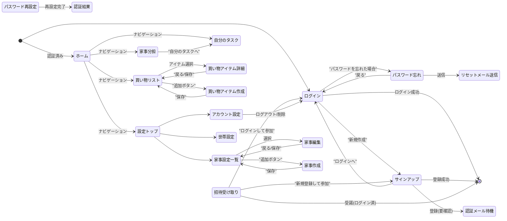

# 画面一覧と遷移図

## 1. 画面一覧

| 画面名 | パス | 認証 | 主な機能 |
| :--- | :--- | :--- | :--- |
| **ログイン** | `/login` | 不要 | ・メール/パスワードでログイン ・パスワード忘れ画面へ遷移 ・サインアップ画面へ遷移 ・Googleログイン（未実装） |
| **サインアップ** | `/signup` | 不要 | ・新規アカウント登録（メール/表示名/パスワード/言語） ・ログイン画面へ遷移 |
| **認証メール待機** | `/signup/verify-wait` | 不要 | ・メール認証待ちメッセージの表示 |
| **メール認証** | `/email-verify` | 不要 | ・メール認証処理（トークン検証） |
| **招待受け取り** | `/invite/:token` | 不要 | ・招待された世帯情報の確認 ・招待の受諾（ログイン/新規登録/既存） ・辞退 |
| **パスワード忘れ** | `/password/forgot` | 不要 | ・パスワードリセットメールの送信要求 |
| **リセットメール送信** | `/password/reset-sent` | 不要 | ・送信完了メッセージの表示 |
| **パスワード再設定** | `/password/reset` | 不要 | ・新しいパスワードの設定 |
| **認証結果** | `/auth/result` | 不要 | ・Firebase認証アクション（パスワードリセット等）の結果表示 |
| **ホーム** | `/home` | **必須** | ・ダッシュボード表示（未対応タスク、買い物リスト、世帯状況） ・各機能へのショートカット |
| **家事分担** | `/housework/assign` | **必須** | ・家事タスク一覧表示（未割当/担当別） ・ドラッグ＆ドロップによる担当変更 ・自分に担当割り当て |
| **自分のタスク** | `/housework/tasks` | **必須** | ・担当タスク一覧表示（過去/今日以降） ・タスク完了/スキップ登録 ・過去タスクの一括完了 |
| **家事設定一覧** | `/settings/housework` | **必須** | ・登録済み家事マスタの一覧表示 ・カテゴリフィルタ ・新規作成/編集画面へ遷移 |
| **家事新規作成** | `/settings/housework/new` | **必須** | ・新しい家事マスタの登録 |
| **家事編集** | `/settings/housework/:houseworkId/edit` | **必須** | ・家事マスタの編集 ・削除 |
| **買い物リスト** | `/shopping` | **必須** | ・未購入/かご/購入済みリストの表示 ・購入場所フィルタ ・かご移動/完了/差し戻し操作 ・アイテム詳細/新規作成へ遷移 |
| **買い物アイテム作成** | `/shopping/new` | **必須** | ・新しい買い物アイテムの登録 |
| **買い物アイテム詳細** | `/shopping/items/:itemId` | **必須** | ・アイテム情報の編集 ・画像追加/削除 ・お気に入り登録 |
| **設定トップ** | `/settings` | **必須** | ・各設定メニューへのナビゲーション |
| **アカウント設定** | `/settings/account` | **必須** | ・プロフィール変更（表示名/アイコン/言語） ・パスワード変更 ・アカウント削除 |
| **世帯設定** | `/settings/household` | **必須** | ・世帯切り替え/新規作成 ・世帯名変更 ・メンバー一覧/招待/削除/権限譲渡 ・世帯削除 |
| **アプリ情報** | `/settings/app` | **必須** | ・アプリ情報の表示 |
| **利用規約** | `/settings/app/terms` | **必須** | ・利用規約の表示 |
| **プライバシー** | `/settings/app/privacy` | **必須** | ・プライバシーポリシーの表示 |

## 2. 画面遷移図

