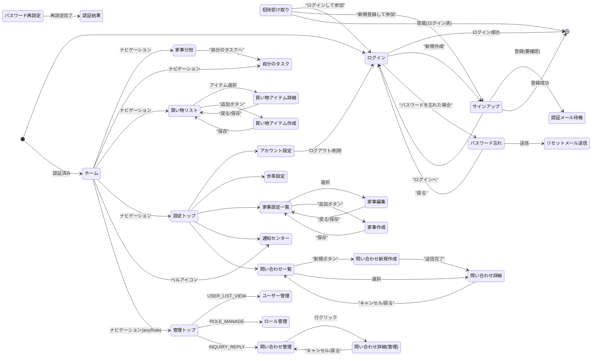

# 画面一覧と遷移図

## 1. 画面一覧

### 凡例（権限列）
- **認証不要**: 未ログインでもアクセス可
- **認証必須**: ログイン済みであればアクセス可
- **anyRole**: ADMIN または SUPPORT のいずれかのロールを持つこと
- **INQUIRY_REPLY**: パーミッション `INQUIRY_REPLY`（問い合わせ返信）が必要
- **USER_LIST_VIEW**: パーミッション `USER_LIST_VIEW`（ユーザー管理）が必要
- **ROLE_MANAGE**: パーミッション `ROLE_MANAGE`（ロール管理）が必要

---

### 認証不要画面

| 画面名 | パス | 権限 | 主な機能 |
| :--- | :--- | :--- | :--- |
| **ログイン** | `/login` | 認証不要 | ・メール/パスワードでログイン ・パスワード忘れ画面へ遷移 ・サインアップ画面へ遷移 ・Googleログイン |
| **サインアップ** | `/signup` | 認証不要 | ・新規アカウント登録（メール/表示名/パスワード/言語） ・ログイン画面へ遷移 |
| **認証メール待機** | `/signup/verify-wait` | 認証不要 | ・メール認証待ちメッセージの表示 |
| **メール認証** | `/email-verify` | 認証不要 | ・メール認証処理（トークン検証） |
| **招待受け取り** | `/invite/:token` | 認証不要 | ・招待された世帯情報の確認 ・招待の受諾（ログイン/新規登録/既存） ・辞退 |
| **パスワード忘れ** | `/password/forgot` | 認証不要 | ・パスワードリセットメールの送信要求 |
| **リセットメール送信** | `/password/reset-sent` | 認証不要 | ・送信完了メッセージの表示 |
| **パスワード再設定** | `/password/reset` | 認証不要 | ・新しいパスワードの設定 |
| **認証結果** | `/auth/result` | 認証不要 | ・認証アクション（パスワードリセット等）の結果表示 |

---

### 一般ユーザー画面（認証必須）

| 画面名 | パス | 権限 | 主な機能 |
| :--- | :--- | :--- | :--- |
| **ホーム** | `/home` | 認証必須 | ・ダッシュボード表示（未対応タスク、買い物リスト、世帯状況） ・各機能へのショートカット |
| **家事分担** | `/housework/assign` | 認証必須 | ・家事タスク一覧表示（未割当/担当別） ・ドラッグ＆ドロップによる担当変更 ・自分に担当割り当て |
| **My Tasks** | `/housework/tasks` | 認証必須 | ・担当タスク一覧表示（過去/今日以降） ・タスク完了/スキップ登録 ・過去タスクの一括完了 |
| **買い物リスト** | `/shopping` | 認証必須 | ・未購入/かご/購入済みリストの表示 ・購入場所フィルタ ・かご移動/完了/差し戻し操作 ・アイテム詳細/新規作成へ遷移 |
| **買い物アイテム作成** | `/shopping/new` | 認証必須 | ・新しい買い物アイテムの登録 |
| **買い物アイテム詳細** | `/shopping/items/:itemId` | 認証必須 | ・アイテム情報の編集 ・画像追加/削除 ・お気に入り登録 |
| **通知センター** | `/notifications` | 認証必須 | ・最新の通知一覧表示 ・通知の既読化 ・各機能への遷移 |

---

### 設定画面（認証必須）

| 画面名 | パス | 権限 | 主な機能 |
| :--- | :--- | :--- | :--- |
| **設定トップ** | `/settings` | 認証必須 | ・各設定メニューへのナビゲーション |
| **アカウント設定** | `/settings/account` | 認証必須 | ・プロフィール変更（表示名/アイコン/言語） ・パスワード変更 ・アカウント削除 |
| **世帯設定** | `/settings/household` | 認証必須 | ・世帯切り替え/新規作成 ・世帯名変更 ・メンバー一覧/招待/削除/権限譲渡 ・世帯削除 |
| **家事設定一覧** | `/settings/housework` | 認証必須 | ・登録済み家事マスタの一覧表示 ・カテゴリフィルタ・ソート・ページング ・新規作成/編集画面へ遷移 |
| **家事新規作成** | `/settings/housework/new` | 認証必須 | ・新しい家事マスタの登録 |
| **家事編集** | `/settings/housework/:houseworkId/edit` | 認証必須 | ・家事マスタの編集・削除 |
| **問い合わせ一覧** | `/settings/inquiry` | 認証必須 | ・問い合わせ一覧表示（カテゴリ・ステータス・ID表示） ・新規問い合わせ画面へ遷移 |
| **問い合わせ新規作成** | `/settings/inquiry/new` | 認証必須 | ・カテゴリ・件名・本文を入力して送信 |
| **問い合わせ詳細** | `/settings/inquiry/:inquiryId` | 認証必須 | ・メッセージスレッド表示 ・返信送信 ・解決済み・スタッフ対応依頼 |
| **アプリ情報** | `/settings/app` | 認証必須 | ・フロント/APIバージョン表示 |
| **利用規約** | `/settings/app/terms` | 認証必須 | ・利用規約の表示 |
| **プライバシー** | `/settings/app/privacy` | 認証必須 | ・プライバシーポリシーの表示 |

---

### 管理画面（ロール・パーミッション必須）

| 画面名 | パス | 権限 | 主な機能 |
| :--- | :--- | :--- | :--- |
| **管理トップ** | `/admin` | anyRole | ・管理機能へのナビゲーション ・パーミッションに応じてカードの有効/無効を表示 |
| **ユーザー管理** | `/admin/users` | USER_LIST_VIEW | ・ユーザー一覧表示（email/isActive/locale で絞り込み） ・ソート・ページング ・新規登録・編集（モーダル） ・パスワード変更 |
| **ロール管理** | `/admin/roles` | ROLE_MANAGE | ・メールアドレスでユーザー検索 ・ロール（ADMIN/SUPPORT）の付与・削除 |
| **問い合わせ管理** | `/admin/inquiries` | INQUIRY_REPLY | ・対応待ち一覧（PENDING_STAFF・作成日時昇順） ・全件検索（日付範囲/userId/カテゴリ/ステータス） ・ソート・ページング ・タブ状態・検索条件の復元 |
| **問い合わせ詳細（管理）** | `/admin/inquiries/:inquiryId` | INQUIRY_REPLY | ・メッセージスレッド表示 ・スタッフとして返信 |

---

## 2. ロールとパーミッションの対応

| ロール | code_value | 保有パーミッション |
| :--- | :--- | :--- |
| **ADMIN** | `ADMIN` | USER_LIST_VIEW / ROLE_MANAGE / INQUIRY_REPLY（全て） |
| **SUPPORT** | `SPPRT` | INQUIRY_REPLY のみ |

---

## 3. 画面遷移図

